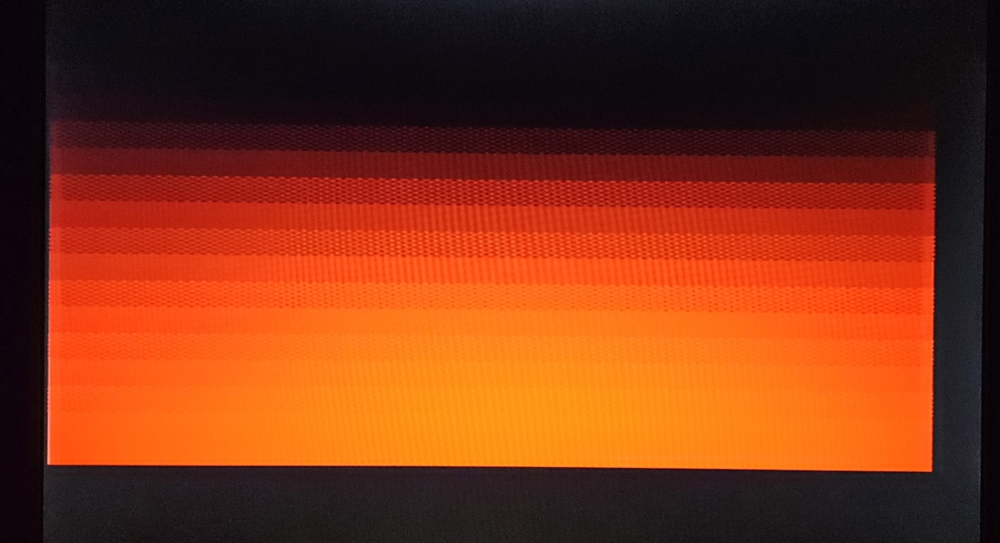
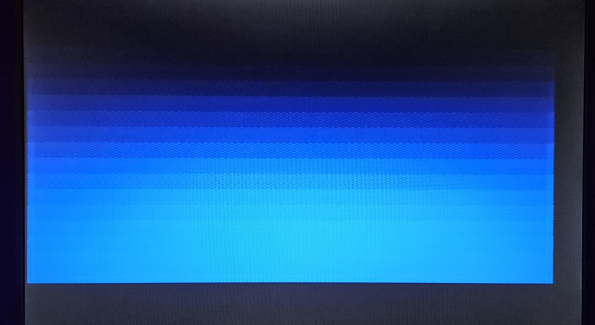
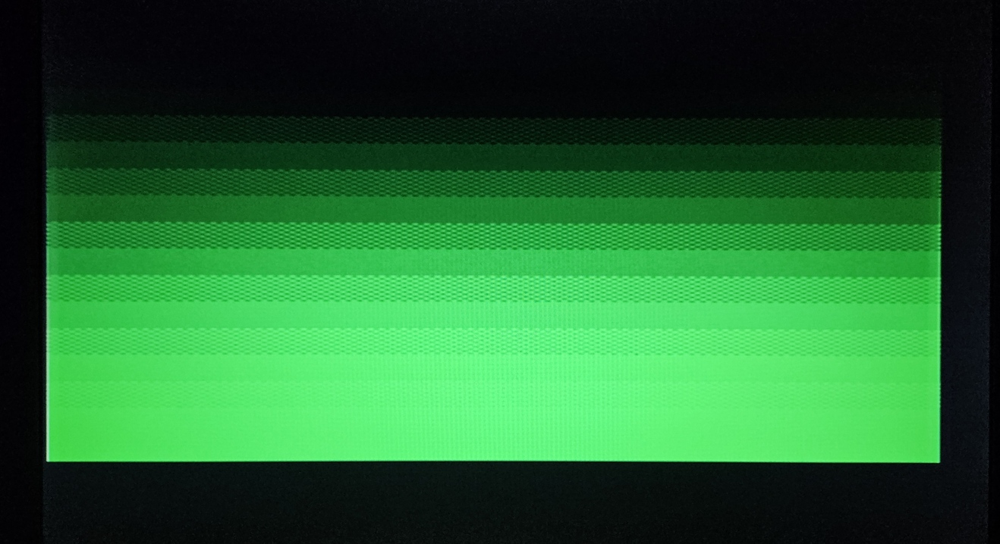
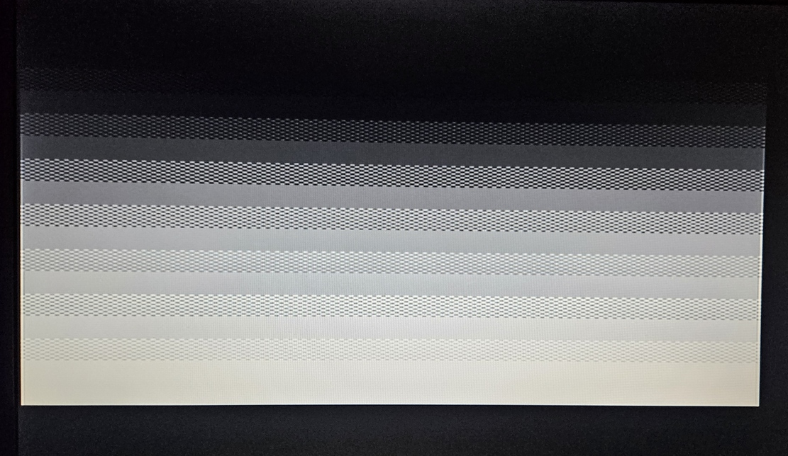
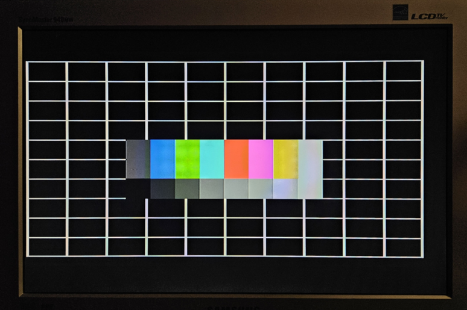
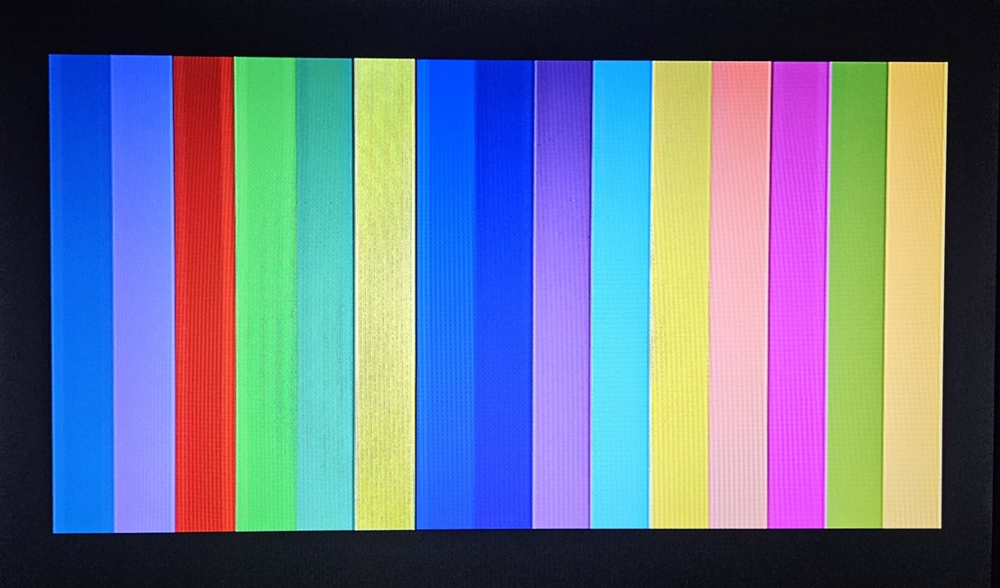
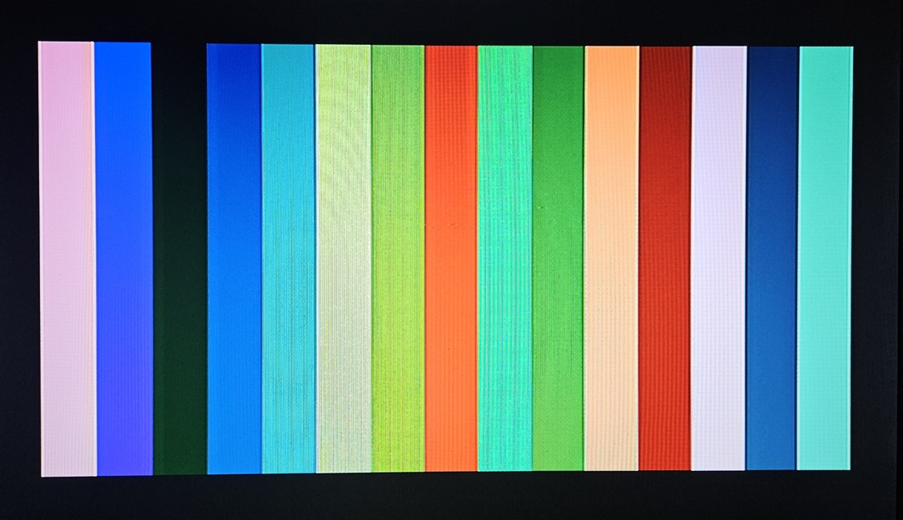
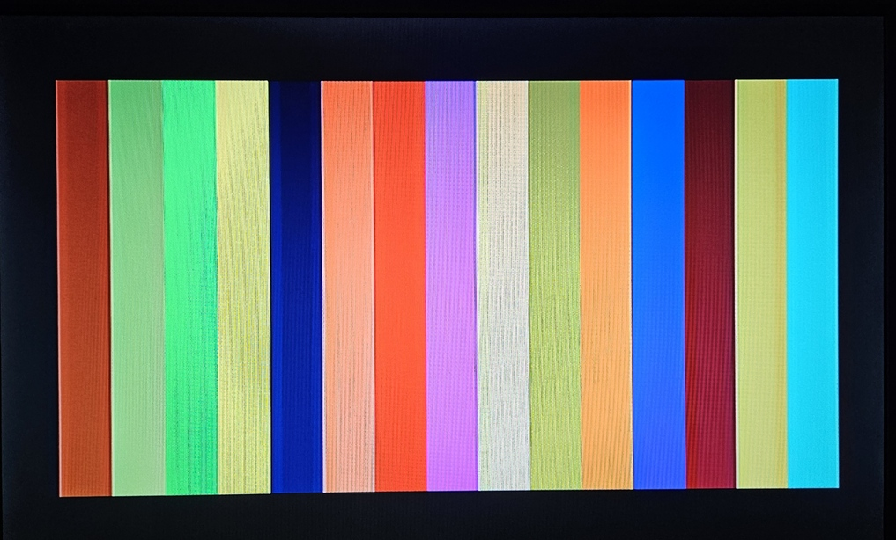
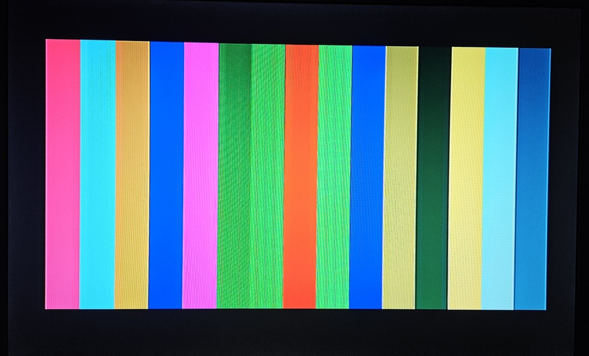
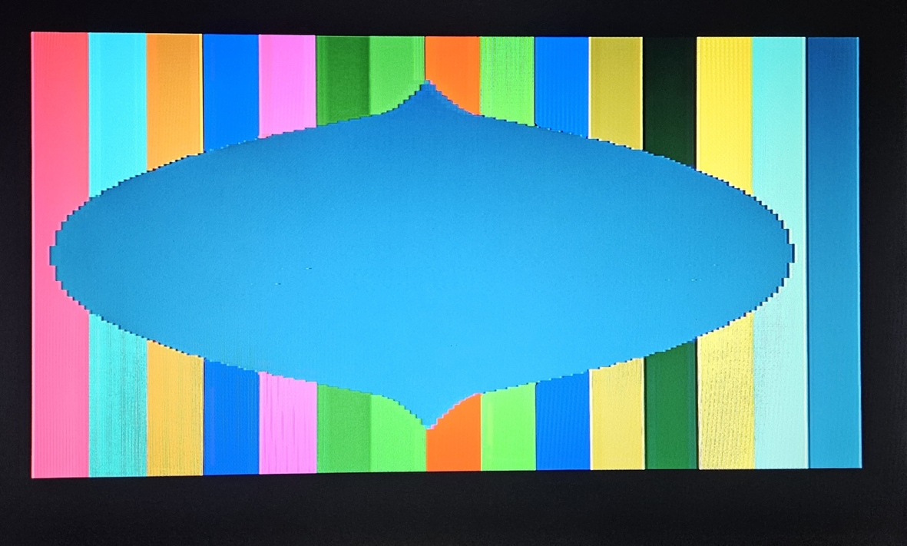

# Olivetti Prodest PC1 - Hidden 160×200×16 Graphics Mode

Enable the undocumented 160×200×16 color graphics mode on the Olivetti Prodest PC1 with a custom 512-color palette.

By **Retro Erik** — [YouTube: Retro Hardware and Software](https://www.youtube.com/@RetroErik)


### �📥 [Download Colorbar.com — interactive demo of the hidden mode](Colorbar.com)

## Overview

The Olivetti Prodest PC1 features a Yamaha V6355D LCDC that supports a hidden 160×200×16 color graphics mode not enabled by the BIOS. This project provides assembly code to unlock and utilize this capability.

| Component | Details |
|-----------|---------|
| **Computer** | Olivetti Prodest PC1 (Italian XT-compatible) |
| **CPU** | NEC V40 (8088/80186-compatible), 7.159 MHz Turbo / 4.773 MHz Normal |
| **Video Chip** | Yamaha V6355D LCDC |
| **VRAM** | 16KB DRAM at segment 0xB000 |
| **Display** | RGB analog via SCART (PAL standard) |
| **Resolution** | 160×200 pixels, 16 colors from 512-color RGB333 palette |

## Quick Start

### Enable the Hidden Mode

```asm
mov al, 0x4A        ; Bit 6 = 16-color mode unlock
out 0xD8, al        ; Write to Mode Control Register — THAT'S IT!
```

That single I/O write is all that's required. The PC1 BIOS defaults for registers 0x65 and 0x67 are already correct for PAL/CRT operation:

| Register | Port | Default | Function |
|----------|------|---------|----------|
| **0x65** | 0x3DD/0x3DE | `0x09` | Monitor control: 200 lines, PAL, color, CRT. Bits 0–1 select line count: 00=192, 01=200, 10=204 |
| **0x67** | 0x3DD/0x3DE | `0x18` | Horizontal position: 8-bit bus + centering. Skip this write to preserve PERITEL.COM's SCART adjustment |

**Caution:** Writing register 0x65 via port 0x3DD *after* palette init corrupts palette state (0x65 falls in the palette command range 0x40–0x4F). Write 0x65 *before* palette init, or follow with `mov al, 0x80 / out 0x3DD, al` + palette restore.

### Compilation

```bash
nasm -f bin colorbar.asm -o colorbar.com
```

## COLORBAR.COM - Graphics Mode Demo

Interactive demonstration of the hidden 160×200×16 graphics mode.

| Key | Function |
|-----|----------|
| **SPACE** | Randomize palette (512 colors) |
| **W** | Reset to CGA palette with 16 color bars |
| **A** | Cycle border color (0-15) |
| **Q** | Draw random colored circle |
| **D** | Gradient dither demo (Red→Green→Blue→Gray) |
| **T** | Draw test pattern (grid, color boxes, gradient) |
| **0** | Set bar width to 10 pixels (fills screen) |
| **1-9** | Set bar width to 1-9 pixels |
| **ESC** | Exit to DOS |
| **/?** | Show help |

## Key Technical Facts

- **Mode unlock:** Write 0x4A to port 0xD8 (aliases: 0xD8 = 0x3D8 on PC1)
- **Pixel format:** Packed nibbles — high nibble = left pixel, low nibble = right pixel (2 pixels per byte, 80 bytes/row)
- **Memory layout:** CGA-style interlaced / non-interleaved — even rows at 0x0000, odd rows at 0x2000 (8KB per bank)
- **Palette:** 16 entries × 2 bytes = 32 bytes. Byte 1: Red (bits 0–2), Byte 2: Green (bits 4–6) | Blue (bits 0–2). Written via ports 0xDD/0xDE with I/O delays required (300ns minimum cycle time)
- **Video output:** Only RGB analog (SCART) supports the custom palette; RGBI digital shows standard CGA colors only
- **Hardware sprite:** 16×16 monochrome cursor via INT 33h (requires Simone's mouse driver)
- **Hardware scrolling:** CRTC R12/R13 pans the display through VRAM. In 192-line mode (register 0x65 = 0x08), the 512-byte gap per bank allows true circular buffer scrolling — write 160 bytes/frame with CRTC MA wrapping at 8K, zero reloads (see demo8c in PC1-Labs)
- **Vertical fine-scroll:** Register 0x64 bits 3–5 provide ±8 line adjustment (verified on real hardware)
- **Per-scanline palette:** Max 1 entry per HBLANK in 160×200×16 mode; up to 6 entries in CGA 320×200×4 mode using the deferred open/close technique
- **PIT raster bars:** PIT interrupts verified working for per-scanline color changes (76 PIT ticks/scanline, 313 lines/frame, 50 Hz PAL). HSYNC polling jitter (4-8 pixels) still present.
- **CPU/pixel phase-lock:** In Turbo mode, CPU clock = pixel clock (7.159 MHz = DCK ÷ 2). 1 CPU cycle = 1 pixel, 456 cycles/scanline. No V6355D bus contention on system RAM. Cycle-counted beam racing is feasible. See PC1-CLOCK-DISCOVERY.md.
- **All 512 colors on screen:** In CGA mode 4, per-scanline palette flipping + deferred palette streaming can display all 512 RGB333 colors simultaneously (verified on real hardware, see cgaflip9 and pc12-bmp4)
- **Vertical line count:** Register 0x65 bits 0–1 select 192, 200, or 204 rows. 204-row mode (from Simone, untested) nearly fills all 16KB VRAM
- **Software fonts required:** The hardware character generator does not work properly in this mode

## Screenshots

*COLORBAR.COM running on real Olivetti Prodest PC1 hardware — 160×200×16 hidden graphics mode:*

<p>
<em>Gradient dither demo — Red</em><br>

</p>

<p>
<em>Gradient dither demo — Blue</em><br>

</p>

<p>
<em>Gradient dither demo — Green</em><br>

</p>

<p>
<em>Gradient dither demo — Gray</em><br>

</p>

<p>
<em>Test pattern on LCD monitor</em><br>

</p>

<p>
<em>16 color bars — CGA palette</em><br>

</p>

<p>
<em>16 color bars — random palette</em><br>

</p>

<p>
<em>16 color bars — random palette</em><br>

</p>

<p>
<em>16 color bars — random palette</em><br>

</p>

<p>
<em>Circle drawn over color bars</em><br>

</p>

## Documentation

For the comprehensive V6355D Technical Reference covering all registers, palette programming, per-scanline techniques, hardware sprite, scrolling, and verified hardware findings, please contact the author Dag Erik Hagesæter (Retro Erik).

## Credits

- **Author:** Dag Erik Hagesæter (Retro Erik)
- **Special Thanks:**
  - Simone Riminucci — Discovered and demonstrated the hidden mode on real PC1 hardware
  - John Elliott — V6355D documentation (some claims unverified on PC1)
  - GitHub Copilot & Claude — AI-assisted development

## License

This project is licensed under the **Creative Commons Attribution-NonCommercial 4.0 International License**. See the [LICENSE](LICENSE) file for details.

## Contributing

Found a bug or improvement? Feel free to create an issue or pull request!

---

## YouTube

For more retro computing content, visit my YouTube channel **Retro Hardware and Software**:
[https://www.youtube.com/@RetroErik](https://www.youtube.com/@RetroErik)
